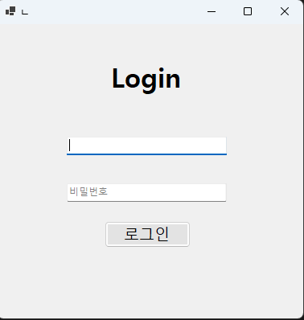
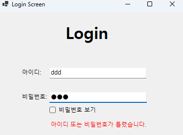
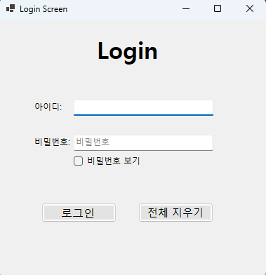
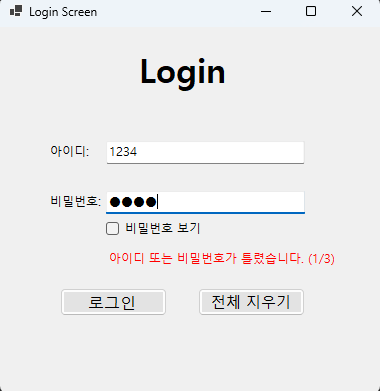

# (C# 코딩) 로그인 스크린

## 개요
- C# 프로그래밍 학습
- 1줄 소개: 사용자로부터 아이디와 비밀번호를 입력받아 로그인 여부를 확인하고, 오류 메시지 표시, 입력 검증, 로그인 제한 기능까지 수행하는 Windows Forms 기반 로그인 프로그램
- 사용한 플랫폼:
-C#, .NET Windows Forms, Visual Studio, GitHub
- 사용한 컨트롤:
  - Label, TextBox, Button, CheckBox
- 사용한 기술과 구현한 기능:
  - Visual Studio를 이용하여 로그인 화면 UI를 직접 설계하였다.
  - string 변수를 이용하여 아이디와 비밀번호 값을 저장하고 비교하였다.
  - TextBox의 Enter, Leave 이벤트를 이용하여 Placeholder 기능을 구현하였다.
  - TextChanged 이벤트를 활용하여 오류 메시지가 자동으로 사라지게 하였다.
  - KeyDown 이벤트를 이용하여 Enter 키로 포커스를 이동하고 로그인할 수 있게 하였다.
  - CheckBox를 이용하여 비밀번호 보기 및 숨기기 기능을 구현하였다.
  - Regex를 이용하여 아이디와 비밀번호의 입력 형식을 검사하였다.
  - DateTime을 이용하여 로그인 실패 횟수 초과 시 일정 시간 동안 로그인을 제한하였다.
- 수업 중에 배우고 사용했던 클래스를 관련된 설명
  - Form 클래스는 프로그램의 기본 화면을 구성하는 데 사용되었다.
  - TextBox 클래스는 아이디와 비밀번호 입력 기능을 구현하는 데 사용되었다.
  - Button 클래스는 로그인 실행과 전체 지우기 기능을 처리하는 데 사용되었다.
  - Label 클래스는 제목 표시와 오류 메시지 출력에 활용되었다.
  - CheckBox 클래스는 비밀번호 표시 여부를 변경하는 데 사용되었다.
  - Regex 클래스는 입력값 형식을 검사하기 위해 사용되었다.
  - DateTime 클래스는 로그인 제한 시간을 계산하고 비교하는 데 사용되었다.
- 실습 중에 구현한 기능들 설명
  - 아이디와 비밀번호 Placeholder 기능
  - 로그인 성공 및 실패 판별 기능
  - 화면 내 오류 메시지 표시 기능
  - Enter 키를 활용한 포커스 이동 및 로그인 기능
  - 전체 지우기 기능
  - 비밀번호 보기 및 숨기기 기능
  - 아이디와 비밀번호 입력 형식 검사 기능
  - 로그인 실패 횟수 제한 및 일정 시간 잠금 기능

## 실행 화면 (과제1)
- 과제1 코드의 실행 스크린샷

- 과제 내용
  - 과제1에서는 로그인 프로그램의 가장 기본이 되는 화면 구성을 목표로 하였다.
  - Label, TextBox, Button 컨트롤을 활용하여 아이디와 비밀번호를 입력할 수 있는 로그인 UI를 설계하였다.
  - 사용자가 화면을 처음 보았을 때 어디에 어떤 값을 입력해야 하는지 쉽게 이해할 수 있도록 입력창의 위치와 제목의 배치를 정리하였다.
  - 아이디 입력창과 비밀번호 입력창을 각각 따로 구성하고, 로그인 버튼을 통해 입력된 값을 확인할 수 있도록 프로그램의 기본 흐름을 만들었다.
  - 또한 단순히 컨트롤을 배치하는 것에 그치지 않고, 사용자가 처음 프로그램을 실행했을 때 입력을 쉽게 시작할 수 있도록 Placeholder 기능도 함께 포함하도록 설계하였다.
  - 즉, 과제1의 핵심은 로그인 프로그램의 기본 형태를 완성하고, 입력과 비교, 결과 출력까지 이어지는 가장 기초적인 구조를 만드는 것이었다.

- 구현 내용과 기능 설명
  - 프로그램 상단에는 로그인 화면임을 알 수 있도록 제목용 Label을 배치하였다.
  - 그 아래에는 아이디와 비밀번호를 입력할 수 있는 두 개의 TextBox를 배치하여 사용자가 직접 정보를 입력할 수 있도록 구성하였다.
  - 각 입력창에는 “아이디”, “비밀번호”라는 Placeholder 문구가 처음 실행 시 회색으로 보이도록 구현하였다.
  - 사용자가 입력창을 클릭하면 Placeholder 문구가 사라지고, 글자색이 검정색으로 바뀌어 실제 입력이 가능하도록 처리하였다.
  - 로그인 버튼을 누르면 TextBox에 입력된 값을 string 변수에 저장한 뒤, 미리 지정한 아이디와 비밀번호 값과 비교하도록 구현하였다.
  - 두 값이 모두 일치하면 로그인 성공 메시지를 출력하고, 하나라도 일치하지 않으면 로그인 실패 메시지를 출력하도록 하여 로그인 기능의 기본 구조를 완성하였다.
  - 이를 통해 가장 기본적인 이벤트 처리와 문자열 비교 기능을 실습할 수 있었다.

## 실행 화면 (과제2)
- 과제2 코드의 실행 스크린샷

- 과제 내용
  - 과제2에서는 로그인 실패 상황에서 사용자에게 오류를 알려주는 방식을 개선하는 것을 목표로 하였다.
  - 과제1에서는 성공과 실패를 메시지 박스로 출력하는 형태였지만, 과제2에서는 로그인 실패 시 별도의 팝업창 대신 화면 안에서 바로 오류를 확인할 수 있도록 수정하였다.
  - 이를 위해 오류 메시지를 출력할 수 있는 Label 컨트롤을 추가하고, 필요할 때만 보이도록 Visible 속성을 활용하였다.
  - 사용자는 로그인 실패 후 팝업창을 닫는 과정을 거치지 않고 바로 입력창을 다시 수정할 수 있도록 하여 프로그램 흐름이 더 자연스러워지도록 설계하였다.
  - 또한 로그인에 실패한 뒤 다시 입력을 시작하면 기존 오류 문구가 자동으로 사라지도록 만들어 화면이 깔끔하게 유지되도록 하는 것도 중요한 목표였다.
  - 즉, 과제2는 오류를 단순히 알리는 수준이 아니라, 사용자 경험을 고려하여 더 편리하게 피드백을 제공하는 방식으로 개선하는 데 의미가 있었다.

- 구현 내용과 기능 설명
  - 먼저 오류 메시지를 출력하기 위한 lblError Label을 화면에 추가하였다.
  - 프로그램이 처음 실행될 때는 오류 메시지가 보이지 않도록 lblError의 Visible 값을 false로 설정하였다.
  - 로그인 버튼 클릭 시 입력된 아이디와 비밀번호가 정답과 일치하지 않는 경우, MessageBox를 띄우는 대신 lblError.Text에 오류 문구를 넣고 Visible 값을 true로 바꾸어 화면 안에 직접 표시되도록 하였다.
  - 이 방식은 사용자가 팝업창을 닫지 않아도 즉시 오류 원인을 확인할 수 있다는 장점이 있었다.
  - 또한 txtID와 txtPW의 TextChanged 이벤트를 이용하여 사용자가 다시 입력을 시작할 경우 기존 오류 메시지가 자동으로 사라지도록 구현하였다.
  - 그 결과 프로그램 동작이 더 자연스러워졌고, 사용자는 로그인 실패 후에도 끊김 없이 바로 다시 시도할 수 있게 되었다.
  - 이를 통해 Visible 속성과 이벤트를 조합한 화면 내 피드백 처리 방식을 익힐 수 있었다.

## 실행 화면 (과제3)
- 과제3 코드의 실행 스크린샷

- 과제 내용
  - 과제3에서는 로그인 프로그램의 사용 편의성을 높이기 위한 UX 개선 기능을 구현하는 것을 목표로 하였다.
  - 사용자가 마우스를 많이 사용하지 않아도 키보드만으로 자연스럽게 입력을 이어갈 수 있도록 Enter 키를 활용한 포커스 이동 기능을 추가하였다.
  - 아이디 입력 후 Enter를 누르면 비밀번호 입력창으로 이동하고, 비밀번호 입력 후 Enter를 누르면 로그인 기능이 바로 실행되도록 하여 실제 서비스와 비슷한 입력 흐름을 만들고자 하였다.
  - 또한 잘못 입력한 내용을 빠르게 정리할 수 있도록 전체 지우기 버튼을 추가하였다.
  - 여기에 더해 비밀번호를 입력한 뒤 사용자가 실제 입력값을 확인할 수 있도록 비밀번호 보기 기능도 함께 구현하였다.
  - 즉, 과제3은 단순히 로그인 기능이 동작하는 수준을 넘어서, 사용자가 실제로 더 편하게 사용할 수 있는 화면을 만드는 데 중점을 둔 단계였다.

- 구현 내용과 기능 설명
  - txtID와 txtPW의 KeyDown 이벤트를 활용하여 Enter 키 입력 시 서로 다른 기능이 실행되도록 구성하였다.
  - 아이디 입력창에서 Enter 키를 누르면 txtPW로 포커스가 이동하도록 하여 사용자가 별도로 마우스를 클릭하지 않아도 다음 입력으로 자연스럽게 넘어갈 수 있게 하였다.
  - 비밀번호 입력창에서는 Enter 키를 누르면 로그인 버튼 클릭과 동일한 기능이 실행되도록 하여 로그인 속도를 높였다.
  - 또한 btnClear 버튼을 추가하여 아이디와 비밀번호 입력값을 한 번에 삭제하고, 포커스를 다시 아이디 입력창으로 이동시키는 전체 지우기 기능을 구현하였다.
  - chkShowPw 체크박스를 추가하여 사용자가 체크했을 때는 비밀번호가 보이고, 해제했을 때는 다시 숨겨지도록 처리하였다.
  - 이 기능을 통해 입력 실수를 줄일 수 있었고, 프로그램의 사용성이 크게 향상되었다.
  - 결과적으로 과제3에서는 실제 로그인 화면에 가까운 편리한 UX를 구현할 수 있었다.

## 실행 화면 (과제4)
- 과제4 코드의 실행 스크린샷

- 과제 내용
  - 과제4에서는 로그인 프로그램의 완성도를 높이기 위해 입력 검증 기능과 보안 기능을 추가하는 것을 목표로 하였다.
  - 먼저 아이디에 입력할 수 없는 문자를 제한하고, 비밀번호에는 반드시 포함되어야 하는 문자 조건과 최소 길이 조건을 검사하도록 설계하였다.
  - 이를 통해 잘못된 형식의 값을 입력했을 때 바로 오류를 알 수 있도록 하여 보다 정확한 입력이 이루어지게 만들고자 하였다.
  - 또한 로그인 실패 횟수를 제한하여 사용자가 여러 번 연속으로 로그인에 실패했을 경우 일정 시간 동안 다시 로그인하지 못하도록 하는 기능도 추가하였다.
  - 일정 시간이 지나면 자동으로 제한이 해제되어 다시 로그인을 시도할 수 있도록 설계하여 보안성과 실용성을 함께 고려하였다.
  - 즉, 과제4는 단순 로그인 판별을 넘어 입력 형식 검사와 로그인 제한 기능까지 포함한 보다 완성도 높은 로그인 프로그램을 구현하는 단계였다.

- 구현 내용과 기능 설명
  - Regex 클래스를 이용하여 아이디와 비밀번호 입력값의 형식을 검사하였다.
  - 아이디는 영문과 숫자만 입력 가능하도록 정규식을 적용하였고, 허용되지 않는 문자가 포함된 경우 오류 메시지를 화면에 표시하도록 구현하였다.
  - 비밀번호는 숫자를 최소 1개 이상 포함하고 전체 길이가 4자 이상이어야 하도록 조건을 설정하였다.
  - 조건에 맞지 않는 경우에는 해당 내용을 lblError에 출력하여 사용자가 어떤 부분을 수정해야 하는지 바로 알 수 있도록 하였다.
  - 또한 failCount, maxFail, isLocked, lockUntil 변수를 사용하여 로그인 실패 횟수와 제한 시간을 관리하였다.
  - 로그인 실패 시 failCount를 증가시키고, 최대 허용 횟수에 도달하면 isLocked를 true로 바꾸어 로그인을 일정 시간 동안 차단하도록 구현하였다.
  - DateTime.Now와 lockUntil을 비교하여 제한 시간이 지나면 잠금이 자동으로 해제되고, 다시 로그인할 수 있도록 처리하였다.
  - 이 과정을 통해 입력 검증, 오류 처리, 로그인 보안 기능까지 포함된 완성도 높은 프로그램을 구현할 수 있었다.

## 배운 내용
- 이번 실습을 통해 Windows Forms의 이벤트 기반 프로그래밍이 실제로 어떻게 활용되는지 더 분명하게 이해할 수 있었다.
- 단순히 버튼 클릭만 처리하는 것이 아니라 Enter, Leave, TextChanged, KeyDown 같은 다양한 이벤트를 조합하면 훨씬 자연스럽고 편리한 프로그램을 만들 수 있다는 점을 배웠다.
- Placeholder 기능을 직접 구현하면서 TextBox의 글자색 변경, 포커스 상태에 따른 동작 변화, 비밀번호 숨김 처리 등을 세밀하게 제어하는 방법을 익힐 수 있었다.
- Regex를 이용한 입력 검증 기능을 구현하면서 정규식이 단순한 문자열 확인이 아니라 프로그램의 안정성과 정확성을 높이는 데 매우 유용하다는 것을 알게 되었다.
- 로그인 실패 횟수 제한 기능을 만들면서 DateTime과 조건문, 상태 변수의 활용 방법을 배울 수 있었고, 프로그램 보안과 사용자 관리에 대한 기본 개념도 함께 이해할 수 있었다.
- 이번 과제를 통해 단순히 실행되는 프로그램을 만드는 것에서 끝나는 것이 아니라, 사용자 편의성과 보안성, 오류 처리까지 함께 고려해야 더 좋은 프로그램이 된다는 점을 알게 되었다.